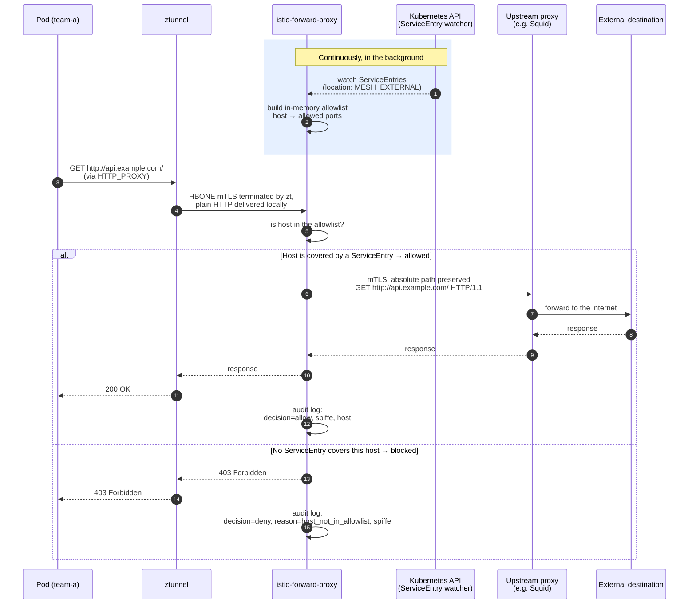

# istio-forward-proxy

A forward proxy for **Istio ambient mode** that preserves absolute paths in
HTTP request-lines when forwarding to an upstream proxy chain.

Envoy's TLS origination (via `ServiceEntry` + `DestinationRule`) rewrites
absolute URLs to relative paths, breaking downstream proxies such as Squid
that require absolute-form requests:

```
Envoy:                GET /politics HTTP/1.1                        ← origin-server form
istio-forward-proxy:  GET http://edition.cnn.com/politics HTTP/1.1  ← proxy form (RFC 7230 §5.3.2)
```

## Why this proxy? Egress control in an Istio ambient mesh

Istio ambient mode does a good job securing traffic inside the mesh. Once a
namespace gets the `istio.io/dataplane-mode=ambient` label, `ztunnel`
intercepts traffic to and from every pod, encrypts it with mTLS, and
attaches a verifiable identity to it (a SPIFFE ID such as
`spiffe://cluster.local/ns/team-a/sa/app-x`). No team has to configure
anything for this; it's part of what the mesh gives you.

That protection stops at the edge of the cluster. By default, any pod can
connect to any external host on any port, with no registration or control
at all. There is no built-in limit on outbound traffic, so a leaked
credential, a compromised library, or a malicious script inside a container
can send data out unnoticed. Nothing records which pod talked to which
external host.

Istio's `ServiceEntry` object is meant to close that gap. You register
which external hosts a pod may reach, and traffic to anything else can be
denied with `outboundTrafficPolicy: REGISTRY_ONLY`. In practice this
setting is rarely turned on, for two reasons. Most organizations already
run a central forward proxy such as Squid for outbound traffic, with its
own authentication and filtering, and don't want to bypass it. And Envoy's
own TLS origination (`ServiceEntry` + `DestinationRule`) rewrites the
absolute request path into a relative one, as shown above, while Squid and
similar proxies require the absolute path. Once an upstream proxy chain is
involved, Istio's native approach breaks the traffic, so teams end up
turning egress enforcement off again.

istio-forward-proxy solves both problems at once. It runs as an ordinary
pod in the mesh, so ztunnel secures it the same way as any other workload,
and it becomes the mandatory path for all outbound traffic. In the
background it watches the Kubernetes API for `ServiceEntry` objects
anywhere in the cluster and keeps an in-memory allowlist up to date.

If a requested host isn't covered by any `ServiceEntry`, the request is
denied with `403 Forbidden` and the attempt is logged, with the caller's
SPIFFE identity attached when it's available in verified form (see
[Audit identity](#audit-identity) below — in ambient mode, without a
waypoint in front of this proxy, it currently isn't). If the host is
covered, the request goes through with the absolute path intact, over
mTLS, to the existing upstream proxy chain.

That makes "no ServiceEntry, no access" a rule that is actually enforced
and auditable for all outbound traffic, the same zero-trust approach Istio
already applies between pods, extended to the edge of the cluster. Every
exception is explicit, owned by a team, and lives as a pull request in Git
instead of a ticket or a firewall rule nobody can find later.

### How it works



In short:

| Without istio-forward-proxy | With istio-forward-proxy |
|---|---|
| Any pod can reach any external address | Only hosts covered by a `ServiceEntry` are reachable |
| No visibility into outbound traffic | Every allowed and denied request is logged with pod identity |
| Egress access via tickets/firewall rules | Egress access via a pull request on a `ServiceEntry` |
| TLS origination breaks existing Squid proxies | Absolute path is preserved, existing proxy infrastructure keeps working |

## Architecture

```
Pod (HTTP_PROXY=forward-proxy:3128)
 │  plain HTTP with absolute path
 ▼
ztunnel (terminates HBONE mTLS at L4,
         delivers plain HTTP -- does not forward pod identity)
 ▼
istio-forward-proxy (this repo)
 │  ACL check via ServiceEntry allowlist
 │  Audit log, SPIFFE identity when verifiable (see Audit identity)
 │  mTLS origination with client certificate
 ▼
upstream proxy chain
 ▼
external Squid (receives absolute path ✅)
 ▼
external destination
```

## Features

| Feature | Description |
|---|---|
| Absolute path forwarding | `GET http://host/path HTTP/1.1` to upstream |
| CONNECT tunnel support | For HTTPS traffic with upstream auth |
| mTLS origination | Client cert via cert-manager, hot-reload on rotation |
| ServiceEntry-based ACL | Only registered hosts are allowed through |
| SPIFFE audit logging | Pod identity per connection in structured logs, when verifiable (see [Audit identity](#audit-identity)) |
| Proxy-Authorization injection | Credentials forwarded to upstream chain |
| Custom header injection | Via `extraHeaders` in values.yaml |
| Prometheus metrics | `/metrics` endpoint with counters and gauges |
| HPA + PDB | Horizontal scaling with graceful disruption |
| Istio ambient integration | `dataplane-mode=ambient` label, PeerAuthentication STRICT |

## Audit identity

The audit log's `spiffe` field is only populated from a source the proxy can
actually verify:

1. A real mTLS peer certificate on the connection (`r.TLS`), when this
   proxy terminates TLS itself.
2. Otherwise, the `X-Forwarded-Client-Cert` header -- but only when
   `TRUST_XFCC_HEADER=true` (`proxy.audit.trustXFCCHeader` in the Helm
   chart) is explicitly set.

`TRUST_XFCC_HEADER` defaults to `false`. In an ambient-mode deployment as
described above, `r.TLS` is always `nil`: ztunnel terminates HBONE mTLS at
L4 and hands this proxy plain TCP, and being an L4 proxy it never parses
HTTP, so it neither sets nor strips `X-Forwarded-Client-Cert` on the way
through. With the default off, that means the `spiffe` field is empty for
every request in this topology as shipped today -- which is honest: there
is currently nothing in front of this proxy that verifies a caller's
identity at the HTTP layer, so nothing is asserted.

Turning `TRUST_XFCC_HEADER` on without addressing that gap does not fix it;
it just lets any caller write an arbitrary identity into the audit trail by
setting that header itself. Only enable it once something upstream of this
proxy actually sanitizes and re-sets `X-Forwarded-Client-Cert` from its own
verified state -- e.g. an Istio ambient waypoint (an L7-aware Envoy
instance, unlike ztunnel) placed in front of this proxy. Envoy itself
defaults the equivalent setting, `forward_client_cert_details`, to
`SANITIZE` for the same reason.

## Project layout

```
.
├── cmd/                             Entrypoint (main.go)
├── internal/
│   ├── audit/                       Structured JSON audit events
│   ├── certs/                       mTLS cert loader + fsnotify hot-reload
│   ├── proxy/                       Core forward proxy + CONNECT handler
│   └── serviceentry/                Kubernetes informer for ACL
├── deploy/
│   ├── docker/Dockerfile            Multi-stage distroless build
│   ├── helm/istio-forward-proxy/    Helm chart
│   └── istio/                       Namespace + example ServiceEntry
├── scripts/
│   ├── build.sh                     Build and push Docker image
│   ├── install.sh                   Helm install wrapper
│   ├── e2e-test.sh                  End-to-end cluster tests
│   ├── verify-absolute-path.sh      Proof that paths stay absolute
│   └── local-test.sh                Local smoke test without a cluster
└── docs/
    ├── ARCHITECTURE.md               Request flow, threading model, design decisions
    ├── OPERATIONS.md                 Day-2 runbook: audit queries, incident response
    └── EGRESS-ENFORCEMENT.md         Making the proxy the *only* path out, cluster-wide
```

## Prerequisites

Before installing, ensure your cluster meets these requirements:

| Requirement | Minimum version | Check |
|---|---|---|
| Kubernetes | 1.28 | `kubectl version` |
| Istio | 1.22 (ambient mode) | `istioctl version` |
| cert-manager | 1.14 | `kubectl -n cert-manager get deploy cert-manager` |
| Helm | 3.12 | `helm version` |

Istio must be installed in **ambient mode** (not sidecar). Verify:

```bash
kubectl get namespace istio-system -o jsonpath='{.metadata.labels}'
# Expected: contains "istio.io/rev" or "istio-injection"

# Check that ztunnel is running on every node
kubectl -n istio-system get daemonset ztunnel
```

cert-manager needs a ClusterIssuer (or Issuer) that can sign certificates for
`forward-proxy.istio-egress.svc.cluster.local`. If you already have an internal
CA, reference it in the values file. If not, a self-signed issuer works for
testing:

```bash
kubectl apply -f - <<'EOF'
apiVersion: cert-manager.io/v1
kind: ClusterIssuer
metadata:
  name: selfsigned-issuer
spec:
  selfSigned: {}
EOF
```

## Installation

### Step 1 — Build or pull the image

**Use the published image** (no build needed):

```bash
# The chart defaults to ghcr.io/mkamerbeek/istio-forward-proxy:0.1.0
# Override in your values file if you use a private registry mirror.
```

**Build and push your own image** (optional, e.g. for air-gapped clusters):

```bash
export IMAGE_REPO=your-registry.corp.local/istio-forward-proxy
export IMAGE_TAG=0.1.0
PUSH=1 ./scripts/build.sh
```

---

### Step 2 — Create the upstream proxy auth Secret

If your upstream proxy requires `Proxy-Authorization`, create the Secret before
installing the chart. The value must be the complete header value, for example
`Basic dXNlcjpwYXNz` (Base64 of `user:pass`).

```bash
kubectl create namespace istio-egress --dry-run=client -o yaml | kubectl apply -f -

kubectl -n istio-egress create secret generic upstream-proxy-auth \
  --from-literal=proxy-auth="Basic $(echo -n 'user:password' | base64)"
```

Verify:

```bash
kubectl -n istio-egress get secret upstream-proxy-auth
```

If your upstream proxy does not require authentication, skip this step and leave
`proxy.upstream.authSecretRef.name` empty in the values file.

---

### Step 3 — Create your values file

Create a file called `my-values.yaml`. The sections below cover every setting
you are likely to need. Copy, uncomment, and adjust what applies to your
environment.

```yaml
# ── Image ────────────────────────────────────────────────────────────────────
image:
  repository: ghcr.io/mkamerbeek/istio-forward-proxy  # or your private mirror
  tag: "0.1.0"
  pullPolicy: IfNotPresent

# imagePullSecrets:         # uncomment if your registry requires credentials
#   - name: registry-cred

# ── Upstream proxy ───────────────────────────────────────────────────────────
proxy:
  upstream:
    # host:port of the first upstream proxy this proxy connects to.
    # This is typically a corporate Squid or ZScaler instance.
    host: "squid.corp.local:3128"

    # Reference the Secret created in Step 2.
    # Leave name empty if no upstream authentication is needed.
    authSecretRef:
      name: "upstream-proxy-auth"
      key: "proxy-auth"

  # ── mTLS to upstream ───────────────────────────────────────────────────────
  mtls:
    enabled: true
    insecureSkipVerify: false   # set true only for testing, never in production

    certManager:
      enabled: true
      issuerRef:
        name: "corp-internal-ca"     # name of your ClusterIssuer or Issuer
        kind: ClusterIssuer
        group: cert-manager.io
      dnsNames:
        - "forward-proxy.istio-egress.svc.cluster.local"
      duration: 2160h     # certificate lifetime  (90 days)
      renewBefore: 360h   # renew this long before expiry (15 days)

    # If cert-manager is not available, reference an existing Secret that
    # contains tls.crt, tls.key, and ca.crt:
    # existingSecret: "my-tls-secret"

  # ── Extra headers sent to the upstream ────────────────────────────────────
  # extraHeaders:
  #   X-Corp-Id: "platform-egress"

  # ── Timeouts ──────────────────────────────────────────────────────────────
  timeouts:
    dial: 10s    # TCP connect to upstream
    idle: 90s    # idle connection timeout
    read: 60s    # upstream read timeout
    write: 60s   # upstream write timeout

# ── Istio ambient integration ─────────────────────────────────────────────────
istio:
  ambient:
    enabled: true   # adds istio.io/dataplane-mode=ambient label to pods

  peerAuthentication:
    enabled: true
    mtlsMode: STRICT    # ztunnel enforces mTLS for all traffic to this proxy

  authorizationPolicy:
    enabled: true
    # Which namespaces are allowed to send traffic to this proxy.
    # "*" means all namespaces — appropriate for a shared central proxy.
    # Restrict to specific namespaces for tighter control:
    allowedNamespaces:
      - "*"
    # Optionally restrict to specific SPIFFE principals (service accounts):
    # allowedPrincipals:
    #   - "cluster.local/ns/team-a/sa/app-x"

# ── Network policies ──────────────────────────────────────────────────────────
networkPolicies:
  egressFromProxy:
    enabled: true
    allowDNS: true
    # CIDR range(s) where your upstream proxy lives.
    # The proxy pod may only open outbound connections to these ranges.
    upstreamCIDRs:
      - 10.20.0.0/16       # replace with the subnet of your upstream proxy
    upstreamPorts:
      - 3128               # port of the upstream proxy (adjust if different)
      - 443                # keep if your upstream also accepts direct TLS

  ingressToProxy:
    enabled: true
    allowFromNamespaces:
      - "*"    # allow all namespaces to reach the proxy on port 3128

# ── Scaling ───────────────────────────────────────────────────────────────────
replicaCount: 2

autoscaling:
  enabled: true
  minReplicas: 2
  maxReplicas: 10
  targetCPUUtilizationPercentage: 70
  targetMemoryUtilizationPercentage: 80

podDisruptionBudget:
  enabled: true
  minAvailable: 1

# ── Resources ─────────────────────────────────────────────────────────────────
resources:
  requests:
    cpu: 100m
    memory: 128Mi
  limits:
    cpu: 1000m
    memory: 512Mi

# ── Monitoring (optional) ─────────────────────────────────────────────────────
serviceMonitor:
  enabled: false       # set true if you have Prometheus Operator installed
  interval: 30s
  labels: {}
  #   release: kube-prometheus-stack   # match your Prometheus selector label
```

---

### Step 4 — Create the namespace

```bash
kubectl apply -f deploy/istio/00-namespace.yaml
```

Verify the namespace has the ambient label:

```bash
kubectl get namespace istio-egress --show-labels
# Expected output includes: istio.io/dataplane-mode=ambient
```

---

### Step 5 — Install the Helm chart

```bash
helm install istio-forward-proxy ./deploy/helm/istio-forward-proxy \
  --namespace istio-egress \
  --values my-values.yaml
```

For upgrades after changing `my-values.yaml`:

```bash
helm upgrade istio-forward-proxy ./deploy/helm/istio-forward-proxy \
  --namespace istio-egress \
  --values my-values.yaml
```

Preview the rendered manifests before installing:

```bash
helm template istio-forward-proxy ./deploy/helm/istio-forward-proxy \
  --namespace istio-egress \
  --values my-values.yaml | less
```

---

### Step 6 — Verify the deployment

**Check pods are running:**

```bash
kubectl -n istio-egress get pods -w
# Expected: 2/2 pods Running (or more if HPA scaled)
```

**Check the certificate was issued** (if cert-manager is enabled):

```bash
kubectl -n istio-egress get certificate
# Expected: READY=True
```

**Check the health endpoints:**

```bash
kubectl -n istio-egress port-forward svc/istio-forward-proxy 9090:9090 &

curl -s http://localhost:9090/healthz
# Expected: {"status":"ok"}

curl -s http://localhost:9090/readyz
# Expected: {"status":"ok"} — only returns ok once ServiceEntry cache is synced
```

**Inspect the current ACL allowlist:**

```bash
curl -s http://localhost:9090/debug/allowlist | jq .
# Returns {} until you add ServiceEntries in Step 7
```

**Check the metrics endpoint:**

```bash
curl -s http://localhost:9090/metrics | grep forward_proxy
```

**Check the audit log:**

```bash
kubectl -n istio-egress logs deployment/istio-forward-proxy \
  | jq 'select(.component == "audit")'
```

---

### Step 7 — Register external hosts via ServiceEntry

The proxy only forwards requests to hosts that are registered in a
`ServiceEntry` with `location: MESH_EXTERNAL`. Each team creates a
ServiceEntry in their own namespace. The proxy watches all namespaces.

**Minimal example — allow `api.example.com` on port 443 only:**

```yaml
apiVersion: networking.istio.io/v1
kind: ServiceEntry
metadata:
  name: api-example-com
  namespace: team-a            # create in the team's own namespace
spec:
  hosts:
    - api.example.com
  ports:
    - number: 443
      name: https
      protocol: HTTPS
  resolution: DNS
  location: MESH_EXTERNAL
```

**Wildcard example — allow any subdomain of `corp.local`:**

```yaml
apiVersion: networking.istio.io/v1
kind: ServiceEntry
metadata:
  name: corp-local-wildcard
  namespace: team-b
spec:
  hosts:
    - "*.corp.local"           # matches foo.corp.local, api.corp.local, etc.
  ports:
    - number: 80
      name: http
      protocol: HTTP
    - number: 443
      name: https
      protocol: HTTPS
  resolution: DNS
  location: MESH_EXTERNAL
```

**No port restriction — allow all ports for a host:**

```yaml
spec:
  hosts:
    - internal-api.corp.local
  # omit the ports block to allow any port
  resolution: DNS
  location: MESH_EXTERNAL
```

Apply and verify the proxy picked it up:

```bash
kubectl apply -f my-serviceentry.yaml

# Allow a few seconds for the informer to sync, then:
curl -s http://localhost:9090/debug/allowlist | jq .
# Expected: the registered host appears in the output
```

Requests to unregistered hosts return `403 Forbidden` with the reason logged
in the audit trail.

---

### Step 8 — Configure workloads

Set `HTTP_PROXY` and `HTTPS_PROXY` in each pod that needs outbound internet
access. All traffic to external hosts goes through the forward proxy.

**In a Deployment:**

```yaml
spec:
  template:
    spec:
      containers:
        - name: app
          env:
            - name: HTTP_PROXY
              value: "http://istio-forward-proxy.istio-egress.svc.cluster.local:3128"
            - name: HTTPS_PROXY
              value: "http://istio-forward-proxy.istio-egress.svc.cluster.local:3128"
            - name: NO_PROXY
              value: ".svc.cluster.local,.cluster.local,10.0.0.0/8,172.16.0.0/12,192.168.0.0/16"
```

Adjust the `NO_PROXY` value to match your cluster's internal CIDRs so that
in-cluster traffic bypasses the proxy.

The pod's namespace must be enrolled in Istio ambient mode. ztunnel intercepts
and encrypts the traffic in transit, but -- as covered in
[Audit identity](#audit-identity) -- terminates that encryption itself before
this proxy ever sees the request, so the `spiffe` field in the audit trail
is empty unless `TRUST_XFCC_HEADER` is set with a trusted hop in front to
back it.

```bash
# Enroll a namespace in ambient mode:
kubectl label namespace team-a istio.io/dataplane-mode=ambient
```

Setting `HTTP_PROXY` only makes the proxy the *default* path — nothing stops
a workload from ignoring it and connecting out directly. See
[docs/EGRESS-ENFORCEMENT.md](docs/EGRESS-ENFORCEMENT.md) for how to make it
the *only* path, with `NetworkPolicy` (and optionally policy-as-code) so
direct egress is actually blocked at the network layer, not just discouraged
by convention.

---

### Step 9 — Verify end-to-end

Run a quick smoke test from inside a pod in an enrolled namespace:

```bash
# Start a temporary curl pod in an enrolled namespace
kubectl -n team-a run smoke-test --image=curlimages/curl --restart=Never \
  --env="HTTP_PROXY=http://istio-forward-proxy.istio-egress.svc.cluster.local:3128" \
  --env="HTTPS_PROXY=http://istio-forward-proxy.istio-egress.svc.cluster.local:3128" \
  -it --rm -- sh

# Inside the pod — test an allowed host:
curl -v http://api.example.com/

# Test an unregistered host (expects 403):
curl -v http://notregistered.example.com/
```

In the proxy logs, confirm the audit events:

```bash
kubectl -n istio-egress logs deployment/istio-forward-proxy \
  | jq 'select(.component == "audit") | {decision, host, spiffe, status}'
```

Expected output for an allowed request:

```json
{
  "decision": "allow",
  "host": "api.example.com",
  "spiffe": "spiffe://cluster.local/ns/team-a/sa/default",
  "status": 200
}
```

Expected output for a blocked request:

```json
{
  "decision": "deny",
  "host": "notregistered.example.com",
  "deny_reason": "host_not_in_service_entry_allowlist"
}
```

## Testing

### Unit tests

```bash
cd internal/proxy && go test -v
```

`TestAbsolutePathPreservation` is the critical test — it proves the proxy
preserves the absolute URI that Envoy would rewrite.

### End-to-end cluster test

```bash
./scripts/e2e-test.sh
```

Tests: ACL deny for unregistered hosts (403), allow after ServiceEntry
registration, metrics endpoint, and structured audit events.

### Absolute path verification

```bash
./scripts/verify-absolute-path.sh
```

Deploys a mock upstream that logs raw request-lines, sends traffic through
the proxy, and fails if a relative path is received.

### Performance test

```bash
make perf-test   # or: ./scripts/perf-test.sh
```

Runs a [k6](https://k6.io) load test against the HTTP forward path: a mock
upstream (`traefik/whoami`) stands in for the real Squid/HTTP upstream, and
k6 drives traffic through the proxy via `HTTP_PROXY`, which — being Go-based
— naturally sends requests in the absolute-form the proxy expects. Needs a
kube context with the Istio `ServiceEntry` CRD registered (any cluster with
Istio installed, or just the CRDs — see `.github/workflows/perf-test.yml`
for how CI provisions one with `kind` + the `istio/base` Helm chart).

Thresholds (`http_req_failed` rate and `http_req_duration` p95/p99, defined
in `scripts/perf/k6-load-test.js`) fail the run — and the
[Performance Test](https://github.com/marckamerbeek/istio-forward-proxy/actions/workflows/perf-test.yml)
GitHub Action — on regression. It runs on every push/PR to `master` that
touches proxy code, and can be triggered manually via `workflow_dispatch`.

## Operations

See [docs/OPERATIONS.md](docs/OPERATIONS.md) for the full operations runbook.

### Certificate rotation

cert-manager rotates the client certificate periodically. The proxy detects
changes via `fsnotify` on the mounted Secret volume and reloads TLS config
without a restart.

### Metrics

Prometheus metrics on `:9090/metrics`:

| Metric | Type | Labels |
|---|---|---|
| `forward_proxy_requests_total` | counter | method, decision |
| `forward_proxy_active_connections` | gauge | — |
| `forward_proxy_upstream_dial_errors_total` | counter | — |
| `forward_proxy_bytes_transferred_total` | counter | direction |

### Debugging

`/debug/allowlist` dumps every team's `ServiceEntry`-derived ACL entries, so
unlike `/metrics` and `/healthz`/`/readyz` it only answers loopback callers —
`kubectl exec` and `kubectl port-forward` both work (port-forward connects
via the pod's own loopback interface), a direct pod-to-pod request from
elsewhere in the cluster gets `403`.

```bash
# Current allowlist
kubectl -n istio-egress port-forward svc/istio-forward-proxy 9090:9090
curl http://localhost:9090/debug/allowlist

# Live audit log
kubectl -n istio-egress logs -f deployment/istio-forward-proxy \
  | jq 'select(.component == "audit")'

# Increase log verbosity
kubectl -n istio-egress set env deployment/istio-forward-proxy LOG_LEVEL=debug
```

## Comparison with Istio TLS origination

The official Istio
[Egress TLS Origination](https://istio.io/latest/docs/tasks/traffic-management/egress/egress-tls-origination/)
task uses `ServiceEntry` + `DestinationRule` + `credentialName`. This proxy
implements the same pattern with one difference:

| Istio + Envoy | This proxy |
|---|---|
| `ServiceEntry` defines allowed hosts | ServiceEntry watcher builds ACL |
| `DestinationRule` with `tls.mode: MUTUAL` | mTLS dial to upstream |
| `credentialName` references a Secret | Same Secret structure, via cert-manager |
| Request to upstream: **relative path** | Request to upstream: **absolute path** |

## License

Apache 2.0 — see [LICENSE](LICENSE).
