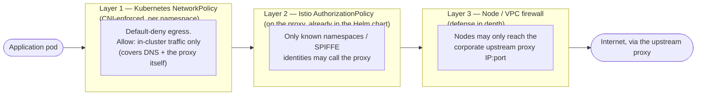

# Enforcing "Egress Only Via the Proxy"

`istio-forward-proxy` gives you a controlled, audited path for outbound
traffic — but it cannot force anything by itself. It is a `Deployment` that
sits on port 3128; nothing stops a workload from ignoring `HTTP_PROXY` and
opening a direct connection to the internet instead. README Step 8
("Configure workloads") shows teams how to *opt in* by setting `HTTP_PROXY`.
This document is the platform-team counterpart: how to make that the only
option, cluster-wide.

## What "just setting HTTP_PROXY" does not protect against

`HTTP_PROXY`/`HTTPS_PROXY` are a client-side convention. Nothing in the
kernel or the network enforces them. All of these bypass the proxy entirely,
with no error and nothing in its audit log:

- An HTTP client that ignores proxy env vars (many `curl`/language HTTP
  clients need explicit proxy configuration; not all honor the env vars by
  default).
- Code that opens a raw `net.Dial`/socket instead of using an HTTP client.
- A dependency, script, or malicious payload making its own outbound
  connection.
- A pod using `hostNetwork: true`, which can sidestep pod-level network
  controls altogether.

None of this is a flaw in the proxy — it was never designed to be the thing
that blocks traffic. That job belongs to the network layer. This guide adds
that layer.

## Prerequisites

Kubernetes `NetworkPolicy` is only enforced if your CNI implements it.
Confirm yours does (Cilium, Calico, and Antrea all support it; some default
cloud CNIs need Network Policy support enabled explicitly, e.g. AWS VPC CNI
requires the network policy add-on):

```bash
kubectl get pods -n kube-system -l k8s-app=cilium 2>/dev/null
kubectl get pods -n kube-system -l k8s-app=calico-node 2>/dev/null
# If neither returns pods, check your CNI's own NetworkPolicy support before
# relying on anything in this guide — an unenforced NetworkPolicy silently
# does nothing.
```

## Cilium: `ipBlock` does not reach cluster-internal destinations

If you're on Cilium, read this before anything else in this guide — it
affects the chart's own default egress `NetworkPolicy`
(`templates/networkpolicy.yaml`), not just the per-namespace policies you
add yourself.

That policy grants the proxy pod egress to the Kubernetes API server (for
the ServiceEntry watch) and to your upstream proxy chain using plain
`ipBlock: 0.0.0.0/0` rules. On most CNIs this is exactly as permissive as
it looks. **On Cilium it is not**: Cilium enforces `NetworkPolicy` based on
security identity, not raw IP, and its translation of `ipBlock`/CIDR rules
only ever matches its "world" identity (genuinely external, non-cluster
traffic) — never a cluster-internal destination, no matter how broad the
CIDR. Two consequences, both confirmed live via `cilium monitor --type
drop`:

1. **The Kubernetes API server rule never grants access.** Cilium resolves
   the API server's real backend to its own *reserved* `kube-apiserver`
   identity. The symptom is silent: the ServiceEntry watcher's initial
   `List` call hangs forever, logging only `"waiting for ServiceEntry
   cache sync"` with no further output (no error, no retry visible), and
   `/readyz` never returns `ok`. It looks like an application bug; it
   isn't.

   ```
   xx drop (Policy denied) ... identity <proxy>->kube-apiserver:
   <proxy-ip>:<port> -> <apiserver-ip>:6443 tcp SYN
   ```

2. **The upstream-proxy-chain rule doesn't work for an in-cluster upstream
   either** — this one isn't specific to reserved identities. If
   `proxy.upstream.host` is itself a Kubernetes Service rather than a
   genuinely external host, `ipBlock` still won't match it, even though
   its Cilium identity is perfectly ordinary:

   ```
   xx drop (Policy denied) ... identity <proxy>-><ordinary-id>:
   <proxy-ip>:<port> -> <upstream-ip>:3128 tcp SYN
   ```

   (External upstreams — a real corporate proxy outside the cluster — are
   unaffected; only an in-cluster upstream Service hits this.)

**Fix**: add a supplementary `CiliumNetworkPolicy` (Cilium's own CRD,
already present wherever Cilium is installed) alongside the chart's
vendored `NetworkPolicy`. Kubernetes `NetworkPolicy` and
`CiliumNetworkPolicy` are additive when both select the same pod, so this
only adds the access that's actually missing — it doesn't replace or
duplicate anything the chart already does:

```yaml
apiVersion: cilium.io/v2
kind: CiliumNetworkPolicy
metadata:
  name: istio-forward-proxy-egress-cilium-supplement
  namespace: istio-egress
spec:
  endpointSelector:
    matchLabels:
      app.kubernetes.io/name: istio-forward-proxy
      app.kubernetes.io/instance: istio-forward-proxy
  egress:
    # Case 1: reach the Kubernetes API server for the ServiceEntry watch.
    - toEntities:
        - kube-apiserver
      toPorts:
        - ports:
            - port: "443"
              protocol: TCP
            - port: "6443"
              protocol: TCP
    # Case 2: reach an in-cluster upstream proxy, if you have one. Adjust
    # matchLabels/namespace to your own upstream's Service selector, and
    # omit this rule entirely if your upstream is external.
    - toEndpoints:
        - matchLabels:
            app: my-upstream-proxy
            k8s:io.kubernetes.pod.namespace: my-upstream-namespace
      toPorts:
        - ports:
            - port: "3128"
              protocol: TCP
```

## Three layers of enforcement

No single control is airtight on its own, so this guide layers three of
them. A workload's traffic has to pass all of them to leave the cluster:



- **Layer 1** is what actually stops a pod from dialing out directly — this
  is the new piece this guide adds.
- **Layer 2** already exists: `istio.authorizationPolicy` in the Helm
  chart's `values.yaml` (see README "Network policies" / "Istio ambient
  integration"). It stops an unexpected caller from reaching the proxy, not
  a workload from bypassing it.
- **Layer 3** is a safety net for the case Layer 1 doesn't apply — a
  misconfigured CNI, or a privileged/`hostNetwork` pod that escapes
  namespace-scoped policy.

## Layer 1 — Default-deny egress NetworkPolicy per namespace

Apply this to every application namespace (`team-a`, `team-b`, ...):

```yaml
apiVersion: networking.k8s.io/v1
kind: NetworkPolicy
metadata:
  name: egress-via-forward-proxy-only
  namespace: team-a
  labels:
    app.kubernetes.io/managed-by: platform-team
spec:
  podSelector: {}          # every pod in this namespace
  policyTypes:
    - Egress
  egress:
    # Allow everything inside the cluster: DNS, other in-mesh services, and
    # the forward-proxy itself all live here. namespaceSelector/podSelector
    # peers only ever match pod IPs the CNI knows about — an external IP
    # can never match this rule, so it cannot leak direct internet egress.
    - to:
        - namespaceSelector: {}

    # Only needed if workloads in this namespace talk to the Kubernetes API
    # directly (client-go, kubectl, controllers). On most managed clusters
    # (EKS/GKE/AKS) the API server is NOT a pod, so the rule above does not
    # cover it — see the same pattern in this chart's own
    # templates/networkpolicy.yaml (egressFromProxy). Adjust the CIDR to
    # your control plane's real endpoint.
    # - to:
    #     - ipBlock:
    #         cidr: <api-server-cidr>/32
    #   ports:
    #     - protocol: TCP
    #       port: 443
```

This is deliberately *not* scoped down to "DNS + proxy only" — an
unrestricted `namespaceSelector: {}` rule is simpler and just as safe here,
because NetworkPolicy peers only ever resolve to pod IPs inside the
cluster. It also avoids silently breaking normal service-to-service traffic
between your workloads, which a narrower rule would.

Do **not** rely on Istio's `outboundTrafficPolicy: REGISTRY_ONLY` for this.
As README explains, ambient mode's `ztunnel` does plain L4 passthrough for
traffic to destinations without a waypoint — by itself it does not block
unregistered outbound hosts the way sidecar-mode Envoy did. `NetworkPolicy`
is the layer that actually blocks the connection attempt.

### Verify

```bash
kubectl -n team-a run smoke-test --image=curlimages/curl --restart=Never \
  -it --rm -- sh

# Inside the pod:

# Direct egress — must fail (connection blocked, not a proxy 403)
curl -m 5 -v https://example.com/
# Expected: times out / "Couldn't connect to server"

# Via the proxy — must still work
HTTP_PROXY=http://istio-forward-proxy.istio-egress.svc.cluster.local:3128 \
  curl -v http://api.example.com/
```

If the direct request gets a `403` instead of timing out, it went through
the proxy anyway — check `HTTP_PROXY`/`HTTPS_PROXY` aren't set globally in
the image, and that the `NetworkPolicy` above is actually applied and
enforced by your CNI.

## Enforcing this at scale

A NetworkPolicy a team applies manually is a NetworkPolicy a team can forget
— or delete. Two ways to make it non-optional:

**GitOps**: template the same manifest per namespace in your platform repo
(ArgoCD `ApplicationSet` generator over namespaces, or a Flux `Kustomize`
overlay per team) so it's re-applied on every sync.

**Policy-as-code (Kyverno)**: generate and continuously reconcile the policy
onto every ambient-enrolled namespace, so a team can't opt out by deleting
it:

```yaml
apiVersion: kyverno.io/v1
kind: ClusterPolicy
metadata:
  name: generate-forward-proxy-egress-policy
spec:
  generateExisting: true
  rules:
    - name: egress-via-forward-proxy-only
      match:
        any:
          - resources:
              kinds:
                - Namespace
              selector:
                matchLabels:
                  istio.io/dataplane-mode: ambient
      exclude:
        any:
          - resources:
              namespaces:
                - istio-egress   # the proxy's own namespace has its own policy
                - istio-system
                - kube-system
      generate:
        apiVersion: networking.k8s.io/v1
        kind: NetworkPolicy
        name: egress-via-forward-proxy-only
        namespace: "{{request.object.metadata.name}}"
        synchronize: true   # Kyverno reverts manual edits/deletes
        data:
          spec:
            podSelector: {}
            policyTypes:
              - Egress
            egress:
              - to:
                  - namespaceSelector: {}
```

`synchronize: true` is the key line: if someone deletes the generated
`NetworkPolicy`, Kyverno recreates it.

## Layer 3 — Node / VPC firewall (defense in depth)

Restrict egress from the cluster's nodes at the network layer too, so a
`NetworkPolicy` gap (misconfigured CNI, a `hostNetwork`/privileged pod that
escapes pod-scoped policy) doesn't translate into open internet access:

- Cloud: a NAT gateway / egress firewall rule allowing nodes to reach only
  the corporate upstream proxy's IP:port (and package registries, cloud
  APIs, etc. your nodes themselves need).
- On-prem: the equivalent router/firewall ACL on the node subnet.

This is a backstop, not a replacement for Layer 1 — it operates on node IPs,
not pod identity, so it can't distinguish which pod inside a node sent the
traffic.

## Detecting bypass attempts

The forward-proxy's audit log only sees traffic that reached it — a request
blocked by `NetworkPolicy` before it left the pod never shows up there. To
see attempted bypasses, watch your CNI's own flow/deny logs, e.g.:

```bash
# Cilium
hubble observe --verdict DROPPED --namespace team-a

# Calico
kubectl exec -n kube-system <calico-node-pod> -- \
  calicoctl get flowlogs   # or your log aggregator, if felix flow logs are enabled
```

Combine both signals: proxy audit log for *allowed and ACL-denied* traffic
that reached the proxy (`decision=allow|deny`, see `docs/OPERATIONS.md`),
CNI flow logs for traffic that never got that far.

## What this still does not protect against

- **DNS exfiltration.** DNS (port 53 to `kube-system`) is allowed by
  necessity — data can still be smuggled out via DNS queries themselves.
  Mitigate with DNS query monitoring/rate-limiting in CoreDNS if this is a
  concern for your threat model.
- **Pods that can bypass NetworkPolicy entirely** (`hostNetwork: true`,
  privileged pods reconfiguring their own netns). Block these at admission
  time — set `pod-security.kubernetes.io/enforce: restricted` on
  application namespaces, the same as `deploy/istio/00-namespace.yaml`
  already does for the proxy's own namespace.

## Checklist

- [ ] CNI confirmed to enforce `NetworkPolicy`
- [ ] `egress-via-forward-proxy-only` (or equivalent) applied to every
      application namespace — manually, via GitOps, or via the Kyverno
      policy above
- [ ] Verified: direct external request from a workload pod times out
- [ ] Verified: request via `HTTP_PROXY` still succeeds
- [ ] Node/VPC firewall restricts node egress to the upstream proxy
- [ ] Pod Security Admission (`restricted`) set on application namespaces
- [ ] CNI flow-log / deny-log visibility in place to catch bypass attempts
